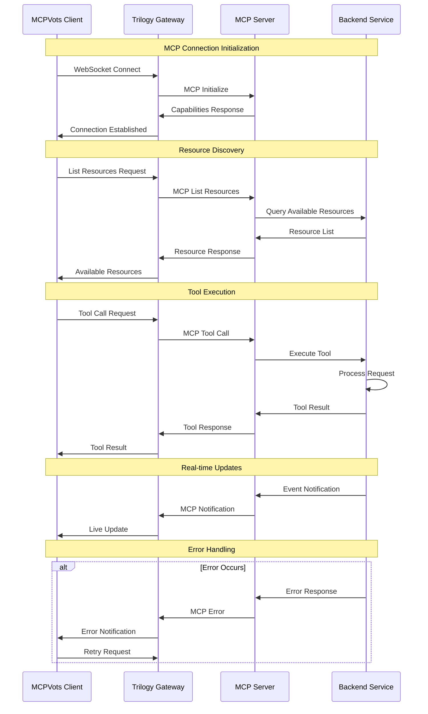
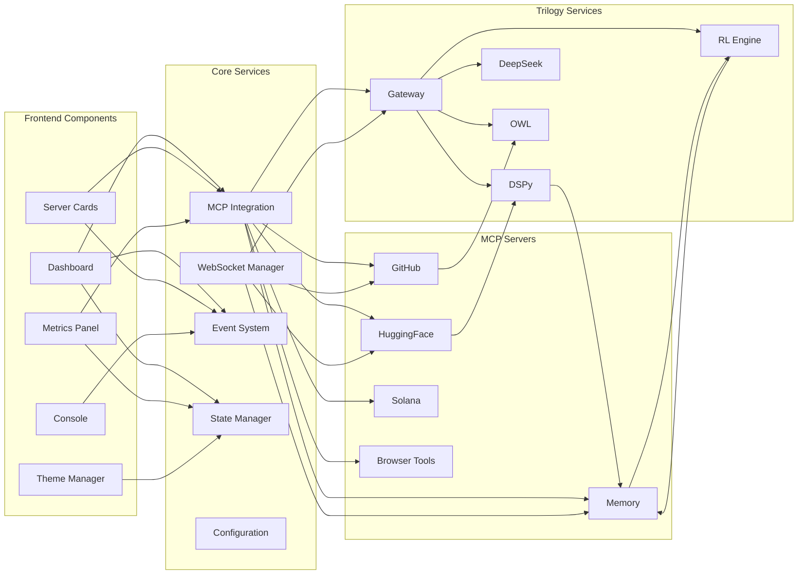
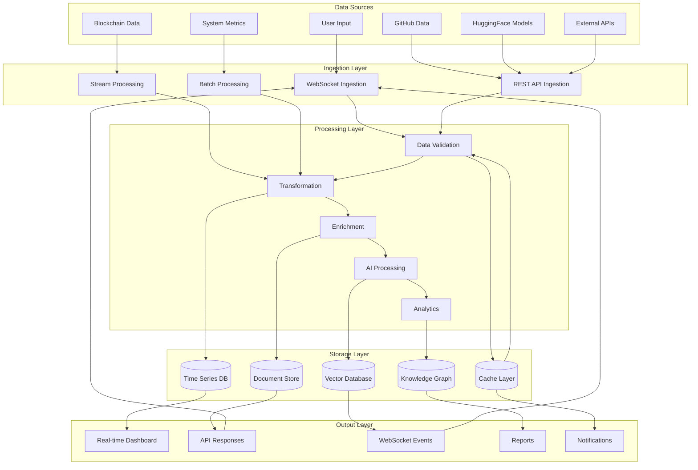
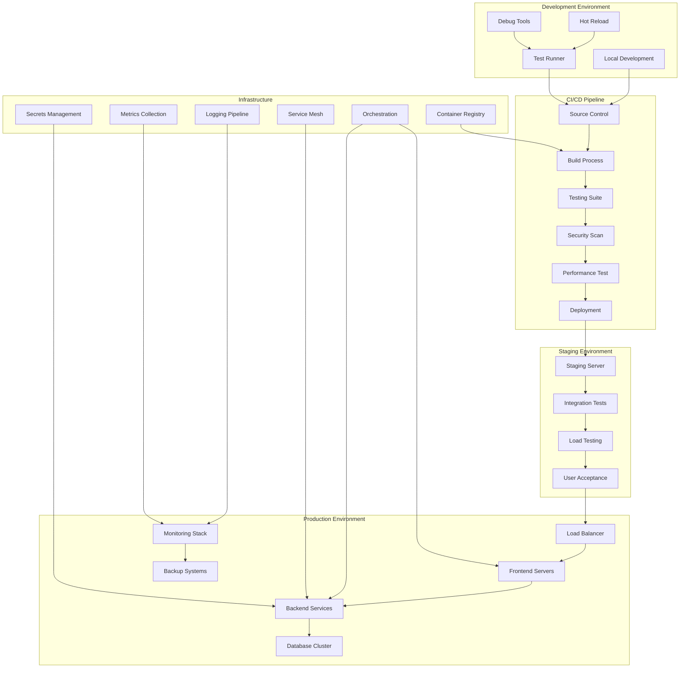
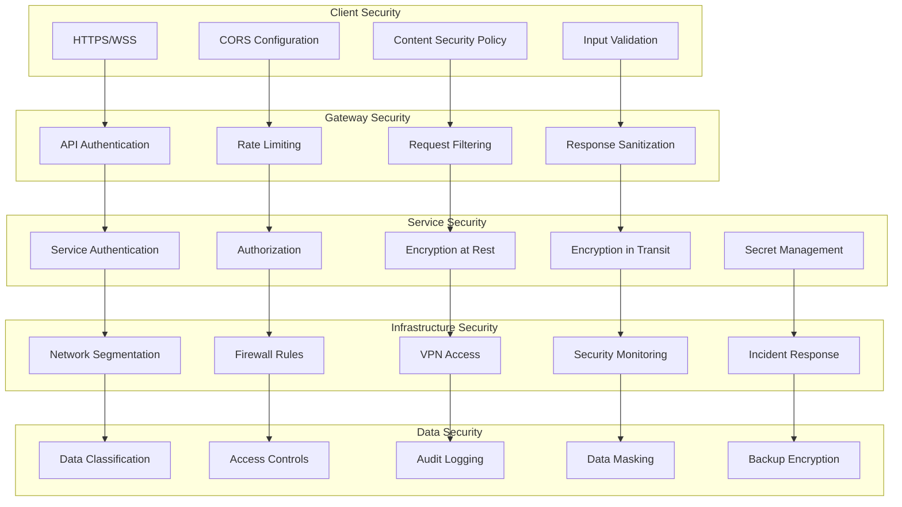
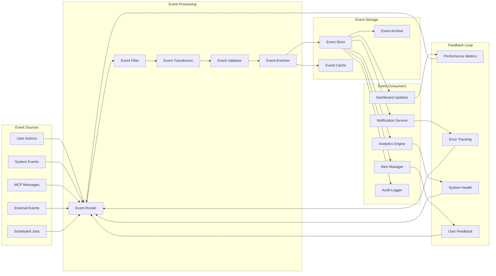

# MCPVots Comprehensive Architecture Diagrams

## 1. System Overview Architecture

```mermaid
graph TB
    subgraph "User Interface Layer"
        UI[MCPVots Dashboard]
        TM[Theme Manager]
        WS[WebSocket Client]
        API[API Client]
    end

    subgraph "Frontend Services"
        FE[Frontend Server:3000]
        WSP[WebSocket Proxy:8080]
        STATIC[Static Assets]
    end

    subgraph "Gateway & Orchestration"
        GW[Trilogy Gateway:8000]
        MC[Mission Control:8005]
        LB[Load Balancer]
        CACHE[Redis Cache]
    end

    subgraph "MCP Server Network"
        direction TB
        MCP1[GitHub MCP:3001]
        MCP2[Memory MCP:3002]
        MCP3[HuggingFace MCP:3003]
        MCP4[SuperMemory MCP:3004]
        MCP5[Solana MCP:3005]
        MCP6[Browser Tools MCP:3006]
    end

    subgraph "Trilogy AGI Services"
        DSP[DSPy Autonomous:8000]
        RL[RL Memory:8001]
        CONV[Conversation:8002]
        DS[DeepSeek R1 + DGM:8003]
        JENOVA[Jenova Orchestrator:8004]
        MC[Mission Control:8005]
        AUTO[Autonomous Operations:8006]
        DGM_INT[DGM Integration:8007]
        OWL[OWL Reasoning:8011]
        AGENT_FILE[Agent File System:8012]
        DGM_EVO[DGM Evolution:8013]
        DEERFLOW[DeerFlow Orchestrator:8014]
        GEMINI_CLI[Gemini CLI Service:8015]
        N8N[n8n Integration:8020]
    end

    subgraph "Monitoring & Analytics"
        MON[System Monitor:8091]
        ANALYTICS[Analytics Dashboard:8090]
        METRICS[Metrics Collector]
        ALERTS[Alert Manager]
    end

    subgraph "Data Layer"
        DB[(Primary Database)]
        VECTOR[(Vector Store)]
        KNOWLEDGE[(Knowledge Graph)]
        LOGS[(Log Storage)]
    end

    subgraph "External Integrations"
        GITHUB[GitHub API]
        HF[HuggingFace Hub]
        SOLANA[Solana Network]
        WEB[Web Services]
    end

    %% User Interface Connections
    UI --> TM
    UI --> WS
    UI --> API
    
    %% Frontend Connections
    WS --> WSP
    API --> FE
    FE --> GW
    WSP --> GW

    %% Gateway Orchestration
    GW --> MC
    GW --> LB
    GW --> CACHE
    MC --> MON

    %% MCP Network
    GW --> MCP1
    GW --> MCP2
    GW --> MCP3
    GW --> MCP4
    GW --> MCP5
    GW --> MCP6

    %% Trilogy Services
    GW --> DSP
    GW --> RL
    GW --> CONV
    GW --> DS
    GW --> JENOVA
    GW --> MC
    GW --> AUTO
    GW --> DGM_INT
    GW --> OWL
    GW --> AGENT_FILE
    GW --> DGM_EVO
    GW --> DEERFLOW
    GW --> GEMINI_CLI
    GW --> N8N

    %% Monitoring
    MON --> ANALYTICS
    MON --> METRICS
    METRICS --> ALERTS

    %% Data Connections
    MCP1 --> GITHUB
    MCP2 --> DB
    MCP2 --> KNOWLEDGE
    MCP3 --> HF
    MCP4 --> VECTOR
    MCP5 --> SOLANA
    MCP6 --> WEB

    %% Storage
    DSP --> DB
    RL --> VECTOR
    DS --> KNOWLEDGE
    OWL --> DB

    %% Logging
    GW --> LOGS
    MCP1 --> LOGS
    MCP2 --> LOGS
    MCP3 --> LOGS
    MCP4 --> LOGS
    MCP5 --> LOGS
    MCP6 --> LOGS

    classDef frontend fill:#e1f5fe
    classDef mcp fill:#f3e5f5
    classDef trilogy fill:#e8f5e8
    classDef monitoring fill:#fff3e0
    classDef data fill:#fce4ec
    
    class UI,TM,WS,API,FE,WSP frontend
    class MCP1,MCP2,MCP3,MCP4,MCP5,MCP6 mcp
    class DSP,RL,DS,OWL trilogy
    class MON,ANALYTICS,METRICS,ALERTS monitoring
    class DB,VECTOR,KNOWLEDGE,LOGS data
```

## 2. MCP Protocol Flow

## 3. Component Interaction Matrix

## 4. Data Flow Architecture

## 5. Deployment Architecture

## 6. Security Architecture

## 7. Real-time Event Flow

This comprehensive architecture documentation provides a complete view of the MCPVots ecosystem from multiple perspectives: system overview, protocol flow, component interactions, data flow, deployment, security, and real-time events. Each diagram serves a specific purpose in understanding different aspects of the system architecture.
