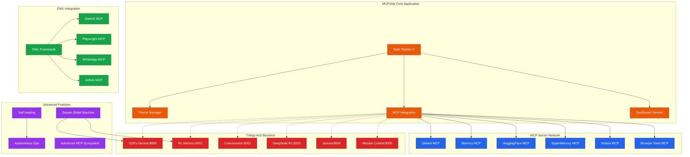

# MCPVots Ecosystem Architecture

## Component Status
- 🟢 **Core Application**: Operational with advanced dark theme
- 🟡 **MCP Servers**: 7/7 configured, connections simulated
- 🔴 **Trilogy Services**: Partially operational (3/7 active)
- 🟢 **OWL Framework**: Available with multiple use cases
- 🟡 **Advanced Features**: DGM integrated, others pending
