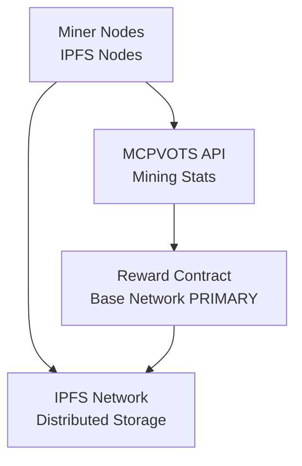

# MCPVOTS IPFS Mining System

## 🌐 Overview

The MCPVOTS IPFS Mining System enables decentralized mining by running IPFS nodes that provide storage and bandwidth for the MCPVOTS ecosystem. Miners earn MCPVOTS tokens based on their contribution to the network through data storage, content pinning, and network participation.

## 🚀 Key Features

- **Decentralized Mining**: Earn rewards by providing IPFS storage and bandwidth
- **Base Network Rewards**: Primary reward claiming on Base Network (Layer 2, low-cost)
- **AI Agent Integration**: MCP server allows AI agents to control mining operations
- **Data Encryption**: Sensitive data is encrypted before IPFS storage
- **Multi-Network Support**: Works with local IPFS nodes, public gateways, or Infura
- **Real-time Analytics**: Comprehensive mining statistics and performance monitoring

## 🛠️ Installation

### Prerequisites

```bash
pip install ipfshttpclient cryptography python-dotenv web3
```

### IPFS Node Setup

For full functionality, install and run an IPFS node:

```bash
# Install IPFS (Kubo)
# Download from: https://dist.ipfs.tech/#kubo

# Initialize IPFS
ipfs init

# Start IPFS daemon
ipfs daemon
```

## ⚙️ Configuration

Create a `.env` file with your configuration:

```env
# IPFS Configuration
IPFS_API_URL=http://localhost:5001
INFURA_IPFS_KEY=your_infura_ipfs_key

# Blockchain Configuration
PRIVATE_KEY=your_wallet_private_key
INFURA_KEY=your_infura_ethereum_key
BASE_RPC_URL=https://mainnet.base.org

# Mining Configuration
MINING_API_URL=https://api.mcpvots.com/mining
REWARD_CONTRACT=0xYourRewardContractAddress
```

## 🚀 Usage

### Basic Mining

```python
from ipfs_mining import MCPVOTSMiner
import asyncio

async def start_mining():
    # Initialize miner
    miner = MCPVOTSMiner(mode="local")  # or "gateway" for testing
    await miner.initialize()

    # Start mining
    await miner.start_mining()

asyncio.run(start_mining())
```

### Command Line

```bash
# Start mining with local IPFS node
python ipfs_mining.py --mode local

# Use public gateway (for testing)
python ipfs_mining.py --mode gateway

# Specify reward contract
python ipfs_mining.py --reward-contract 0x1234... --mode local

# Run as daemon
python ipfs_mining.py --daemon
```

### MCP Server for AI Agents

```python
from ipfs_mcp_server import IPFSMiningMCPServer
import asyncio

async def run_mcp_server():
    server = IPFSMiningMCPServer()
    await server.run()

asyncio.run(run_mcp_server())
```

## 🤖 MCP Tools

The IPFS MCP Server provides these tools for AI agents:

- `initialize_miner` - Initialize miner with configuration
- `start_mining` - Start mining operations
- `stop_mining` - Stop mining operations
- `get_mining_status` - Get current status and statistics
- `pin_content` - Pin content to IPFS (with encryption)
- `unpin_content` - Remove pinned content
- `get_content` - Retrieve content from IPFS
- `list_pinned_content` - List all pinned content
- `claim_rewards` - Claim mining rewards
- `get_network_info` - Get IPFS network information
- `pin_ecosystem_data` - Pin important ecosystem data

## 📊 Mining Mechanics

### Scoring Algorithm

Mining score is calculated as:
```
score = uptime_hours × peers_connected × data_factor
```

Where:
- `uptime_hours`: Hours the miner has been running
- `peers_connected`: Number of IPFS peers connected
- `data_factor`: Bonus based on data pinned (1 + MB_pinned / 1024)

### Reward Claims

Rewards are primarily claimed on:

- **Base Network (PRIMARY)**: Layer 2 network with low gas fees and fast transactions
- **Ethereum (FALLBACK)**: Only used if Base network is unavailable

The system prioritizes Base Network for all reward operations to minimize costs.

## 🔒 Security Features

- **Data Encryption**: All sensitive data is encrypted using Fernet (AES 128)
- **Key Derivation**: Encryption keys are derived from miner identity
- **Secure Storage**: Encrypted data storage with tamper detection
- **Access Control**: Private key protection for reward claiming

## 📈 Monitoring

### Real-time Statistics

- Mining uptime and score
- Connected peers count
- Data pinned (MB)
- Bandwidth served (MB)
- Network connectivity status

### API Endpoints

Mining statistics are reported to the MCPVOTS API for:
- Leaderboard ranking
- Reward distribution
- Network analytics

## 🧪 Testing

Run the test suite:

```bash
python test_ipfs_mining.py
```

Tests include:
- Miner initialization
- Encryption/decryption
- Status reporting
- MCP server functionality
- Network connectivity

## 🔧 Troubleshooting

### Common Issues

1. **IPFS Connection Failed**
   - Ensure IPFS daemon is running: `ipfs daemon`
   - Check API URL in `.env`
   - Try gateway mode for testing

2. **Reward Claim Failed**
   - Verify private key in `.env`
   - Check wallet balance for gas fees
   - Ensure reward contract address is correct

3. **Low Mining Score**
   - Increase uptime
   - Connect to more IPFS peers
   - Pin more ecosystem data

### Logs

Check logs in the console or configure logging level:

```python
import logging
logging.basicConfig(level=logging.DEBUG)
```

## 🌐 Network Architecture



## 📚 API Reference

### MCPVOTSMiner Class

#### Methods

- `initialize()` - Initialize IPFS and blockchain connections
- `start_mining()` - Begin mining operations
- `stop_mining()` - Stop mining operations
- `get_status()` - Get current mining status
- `claim_rewards()` - Claim mining rewards
- `pin_ecosystem_data()` - Pin important ecosystem data

#### Properties

- `mining_score` - Current mining score
- `peers_connected` - Number of connected IPFS peers
- `data_pinned` - Bytes of data pinned
- `is_mining` - Mining status

## 🤝 Contributing

1. Fork the repository
2. Create a feature branch
3. Add tests for new functionality
4. Ensure all tests pass
5. Submit a pull request

## 📄 License

This project is part of the MCPVOTS ecosystem. See LICENSE file for details.

## 🆘 Support

For support and questions:

- Check the troubleshooting section
- Review the test output for diagnostics
- Join the MCPVOTS community discussions

---

Built for the decentralized future with ❤️ by the MCPVOTS team
