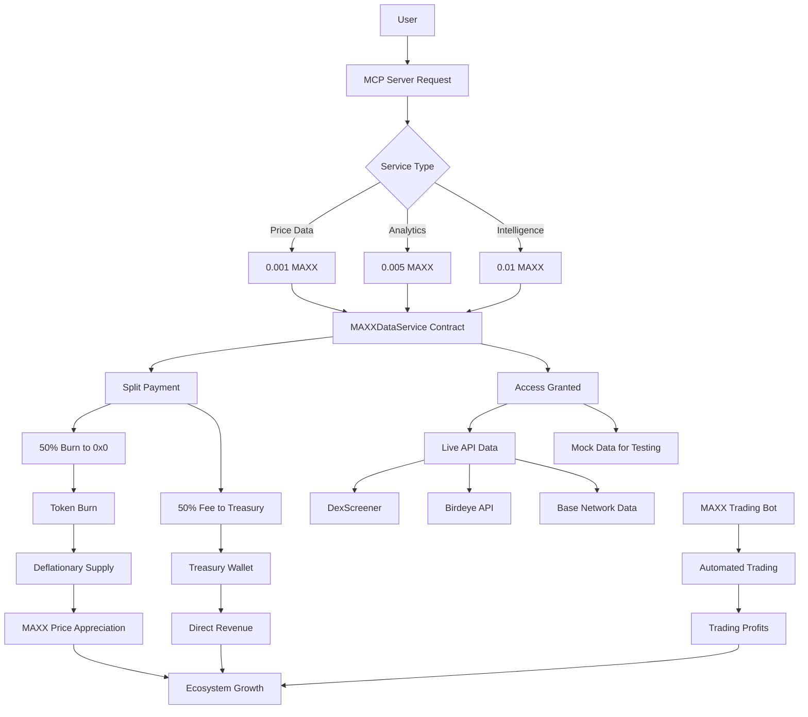

# MAXX Ecosystem Flow Diagram

```mermaid
graph TD
    A[User] --> B[MCP Server Request]
    B --> C{Service Type}
    C -->|Price Data| D[0.001 MAXX]
    C -->|Analytics| E[0.005 MAXX]
    C -->|Intelligence| F[0.01 MAXX]

    D --> G[MAXXDataService Contract]
    E --> G
    F --> G

    G --> H[Split Payment]
    H --> I[50% Burn to 0x0]
    H --> J[50% Fee to Treasury]

    G --> K[Access Granted]
    K --> L[Live API Data]
    K --> M[Mock Data for Testing]

    L --> N[DexScreener]
    L --> O[Birdeye API]
    L --> P[Base Network Data]

    J --> Q[Treasury Wallet]
    Q --> R[Direct Revenue]

    I --> S[Token Burn]
    S --> T[Deflationary Supply]
    T --> U[MAXX Price Appreciation]

    V[MAXX Trading Bot] --> W[Automated Trading]
    W --> X[Trading Profits]

    R --> Y[Ecosystem Growth]
    U --> Y
    X --> Y
```
