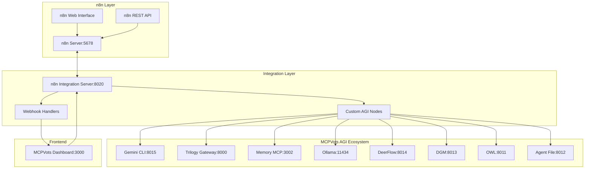

# n8n Integration with MCPVots AGI Ecosystem

## Overview

This document describes the comprehensive integration of **n8n** (workflow automation platform) with the MCPVots AGI ecosystem, providing visual workflow automation capabilities for AGI-powered development, testing, and deployment processes.

## Architecture

### Core Components



### Integration Points

1. **n8n Integration Server (Port 8020)**
   - WebSocket MCP server for n8n integration
   - Custom AGI node execution engine
   - Webhook management and triggers
   - Workflow orchestration bridge

2. **Custom AGI Nodes**
   - `agi_gemini`: Gemini CLI integration
   - `agi_trilogy`: Trilogy AGI gateway
   - `agi_memory`: Memory MCP operations
   - `agi_ollama`: Local LLM processing
   - `agi_deerflow`: Workflow optimization
   - `agi_dgm`: Self-improvement engine
   - `agi_owl`: Semantic reasoning
   - `agi_agent_file`: Multi-agent coordination

3. **Webhook Automation**
   - Code commit triggers
   - Performance monitoring alerts
   - Learning cycle initiation
   - Deployment pipeline triggers

## Installation and Setup

### Prerequisites

- Node.js 18+ and npm
- Python 3.8+
- Docker (optional, for containerized n8n)
- Git (optional)

### Quick Setup

```bash
# Install and setup n8n + AGI integration
npm run n8n:setup

# Quick start (for development)
npm run n8n:quick

# Run integration tests
npm run n8n:test

# Open n8n dashboard
npm run n8n:dashboard
```

### Manual Setup

```bash
# 1. Setup n8n environment
python n8n_integration_manager.py

# 2. Start AGI ecosystem
python comprehensive_ecosystem_orchestrator.py

# 3. Launch n8n integration
python n8n_agi_launcher.py --mode full

# 4. Verify installation
python test_n8n_integration.py
```

## Custom AGI Nodes

### Gemini CLI Node (`agi_gemini`)

**Purpose**: Advanced reasoning with 1M token context and Google Search grounding

**Parameters**:
- `operation`: chat, analyze, generate
- `prompt`: Input prompt
- `model`: gemini-pro, gemini-pro-vision
- `temperature`: 0.0 - 2.0

**Example Usage**:
```json
{
  "type": "agi_gemini",
  "name": "Code Analysis",
  "parameters": {
    "operation": "analyze",
    "prompt": "Analyze this code for security vulnerabilities: {{$json['code']}}",
    "model": "gemini-pro",
    "temperature": 0.3
  }
}
```

### Trilogy AGI Node (`agi_trilogy`)

**Purpose**: Comprehensive AGI reasoning and autonomous agents

**Parameters**:
- `taskType`: reasoning, planning, execution, analysis
- `inputData`: JSON data to process
- `complexity`: simple, medium, complex, expert

**Example Usage**:
```json
{
  "type": "agi_trilogy",
  "name": "Advanced Planning",
  "parameters": {
    "taskType": "planning",
    "inputData": {"project": "deployment", "constraints": ["time", "resources"]},
    "complexity": "expert"
  }
}
```

### Memory MCP Node (`agi_memory`)

**Purpose**: Knowledge graph and persistent memory operations

**Parameters**:
- `operation`: store, retrieve, search, update
- `content`: Data to store (for store/update)
- `query`: Search query (for retrieve/search)
- `memoryType`: knowledge_graph, episodic, semantic, working

**Example Usage**:
```json
{
  "type": "agi_memory",
  "name": "Store Analysis Results",
  "parameters": {
    "operation": "store",
    "content": "{{$json}}",
    "memoryType": "knowledge_graph"
  }
}
```

### Ollama Local Node (`agi_ollama`)

**Purpose**: Local language model processing

**Parameters**:
- `model`: Model name (llama2, codellama, etc.)
- `prompt`: Input prompt
- `temperature`: 0.0 - 2.0
- `maxTokens`: Maximum tokens to generate

**Example Usage**:
```json
{
  "type": "agi_ollama",
  "name": "Code Generation",
  "parameters": {
    "model": "codellama",
    "prompt": "Generate Python function for: {{$json['description']}}",
    "temperature": 0.7,
    "maxTokens": 512
  }
}
```

### DeerFlow Node (`agi_deerflow`)

**Purpose**: Adaptive workflow management and optimization

**Parameters**:
- `action`: create_workflow, execute_workflow, optimize, monitor
- `workflowData`: Workflow configuration
- `optimizationTarget`: performance, efficiency, quality, resource_usage

**Example Usage**:
```json
{
  "type": "agi_deerflow",
  "name": "Optimize Workflow",
  "parameters": {
    "action": "optimize",
    "workflowData": "{{$json}}",
    "optimizationTarget": "performance"
  }
}
```

## Workflow Templates

### 1. AGI Code Analysis Pipeline

**Trigger**: Webhook (code commits)
**Nodes**:
1. Gemini CLI - Code quality analysis
2. Memory MCP - Store analysis results
3. DeerFlow - Workflow optimization

**Use Case**: Automated code review and quality assessment

### 2. Continuous Learning Pipeline

**Trigger**: Schedule (hourly/daily)
**Nodes**:
1. Memory MCP - Retrieve recent insights
2. Trilogy AGI - Advanced reasoning
3. DGM - Self-improvement
4. Ollama - Local processing

**Use Case**: Continuous AI learning and knowledge integration

### 3. Multi-Modal Processing

**Trigger**: API call
**Nodes**:
1. OWL - Semantic analysis
2. Agent File - Coordinate processing
3. Gemini CLI - Generate insights

**Use Case**: Complex multi-modal data processing

### 4. Automated Deployment

**Trigger**: Webhook (deployment request)
**Nodes**:
1. Gemini CLI - Pre-deployment analysis
2. OWL - Semantic validation
3. Agent File - Coordinate deployment
4. HTTP Request - Trigger deployment

**Use Case**: AI-validated automated deployments

## API Reference

### n8n Integration Server Endpoints

#### WebSocket Methods

**Health Check**
```json
{
  "method": "n8n/health",
  "params": {}
}
```

**Create Workflow**
```json
{
  "method": "n8n/create_workflow",
  "params": {
    "name": "Workflow Name",
    "trigger_type": "webhook|schedule|manual",
    "nodes": [...]
  }
}
```

**Execute Workflow**
```json
{
  "method": "n8n/execute_workflow",
  "params": {
    "workflow_id": "workflow_id",
    "input_data": {...}
  }
}
```

**Get AGI Nodes**
```json
{
  "method": "n8n/get_agi_nodes",
  "params": {}
}
```

**Create Webhook**
```json
{
  "method": "n8n/create_webhook",
  "params": {
    "webhook_id": "unique_id",
    "workflow_id": "workflow_id"
  }
}
```

### REST API Endpoints

**n8n Server**: `http://localhost:5678/api/v1`
**Integration Server**: `http://localhost:8020`

## Configuration

### Environment Variables

```bash
# n8n Configuration
N8N_BASIC_AUTH_ACTIVE=false
N8N_HOST=localhost
N8N_PORT=5678
N8N_PROTOCOL=http
WEBHOOK_URL=http://localhost:5678/

# AGI Services
GEMINI_API_KEY=your_gemini_api_key
TRILOGY_URL=http://localhost:8000
MEMORY_URL=http://localhost:3002
OLLAMA_URL=http://localhost:11434
```

### MCP Configuration

Add to `mcp-config.json`:

```json
{
  "name": "n8n Integration Server",
  "url": "ws://localhost:8020",
  "enabled": true,
  "capabilities": [
    "workflow-automation",
    "agi-nodes",
    "webhook-triggers",
    "data-pipelines"
  ]
}
```

## Usage Examples

### Example 1: Automated Code Review

```javascript
// Workflow: Code Review on Commit
const workflow = {
  "name": "AI Code Review",
  "trigger": "webhook",
  "nodes": [
    {
      "type": "agi_gemini",
      "name": "Security Analysis",
      "parameters": {
        "operation": "analyze",
        "prompt": "Review for security issues: {{$json.code}}"
      }
    },
    {
      "type": "agi_memory",
      "name": "Store Results",
      "parameters": {
        "operation": "store",
        "content": "{{$json}}"
      }
    }
  ]
};
```

### Example 2: Performance Monitoring

```javascript
// Workflow: Performance Alert Response
const performanceWorkflow = {
  "name": "Performance Response",
  "trigger": "webhook",
  "nodes": [
    {
      "type": "agi_trilogy",
      "name": "Analyze Performance",
      "parameters": {
        "taskType": "analysis",
        "complexity": "expert"
      }
    },
    {
      "type": "agi_deerflow",
      "name": "Optimize System",
      "parameters": {
        "action": "optimize",
        "optimizationTarget": "performance"
      }
    }
  ]
};
```

### Example 3: Learning Integration

```javascript
// Workflow: Daily Learning Cycle
const learningWorkflow = {
  "name": "Daily Learning",
  "trigger": "schedule",
  "nodes": [
    {
      "type": "agi_memory",
      "name": "Get Recent Data",
      "parameters": {
        "operation": "retrieve",
        "query": "recent_patterns"
      }
    },
    {
      "type": "agi_dgm",
      "name": "Self-Improve",
      "parameters": {
        "evolution_type": "knowledge_integration"
      }
    }
  ]
};
```

## Testing and Validation

### Test Suite

```bash
# Run comprehensive integration tests
python test_n8n_integration.py

# Test specific components
python -m pytest tests/test_n8n_nodes.py
python -m pytest tests/test_workflows.py
python -m pytest tests/test_webhooks.py
```

### Health Monitoring

```bash
# Check n8n server health
curl http://localhost:5678/api/v1/health

# Check integration server health
curl http://localhost:8020/health

# Check all AGI services
npm run services:health
```

## Troubleshooting

### Common Issues

1. **n8n won't start**
   - Check Node.js version (18+ required)
   - Verify port 5678 is available
   - Check Docker if using containerized setup

2. **AGI nodes not available**
   - Ensure custom nodes are built: `npm run build` in custom-nodes directory
   - Restart n8n server after installing custom nodes
   - Check TypeScript compilation errors

3. **Workflows fail to execute**
   - Verify AGI services are running
   - Check service URLs and ports
   - Review webhook configurations

4. **WebSocket connection issues**
   - Check firewall settings
   - Verify WebSocket server is running on port 8020
   - Test with direct WebSocket client

### Debug Mode

```bash
# Enable debug logging
python n8n_agi_launcher.py --verbose

# Check service logs
tail -f n8n_agi_launcher.log
tail -f ecosystem_orchestrator.log
```

## Roadmap

### Phase 1 (Current)
- ✅ Basic n8n integration
- ✅ Custom AGI nodes
- ✅ Workflow templates
- ✅ WebSocket bridge

### Phase 2 (Next)
- 🔄 Advanced workflow patterns
- 🔄 Visual workflow designer integration
- 🔄 Real-time monitoring dashboard
- 🔄 Workflow version control

### Phase 3 (Future)
- 📋 AI-generated workflow creation
- 📋 Predictive workflow optimization
- 📋 Multi-tenant workflow isolation
- 📋 Enterprise workflow patterns

## Contributing

### Development Setup

```bash
# Clone and setup
git clone <repository>
cd MCPVots

# Install dependencies
npm install
pip install -r requirements.txt

# Setup development environment
npm run n8n:setup

# Run tests
npm run n8n:test
```

### Adding Custom Nodes

1. Create node in `n8n/custom-nodes/src/nodes/`
2. Update `package.json` to include new node
3. Build TypeScript: `npm run build`
4. Restart n8n server
5. Test node functionality

### Workflow Template Guidelines

1. Use descriptive names and comments
2. Include error handling nodes
3. Test with various input scenarios
4. Document required parameters
5. Provide usage examples

## Support

- **Documentation**: This file and inline code comments
- **Issues**: GitHub issues for bugs and feature requests
- **Discussions**: GitHub discussions for questions and ideas
- **Testing**: Comprehensive test suite for validation

---

**Last Updated**: 2024-12-28
**Version**: 1.0.0
**Compatibility**: n8n 1.0+, MCPVots 2.0+
