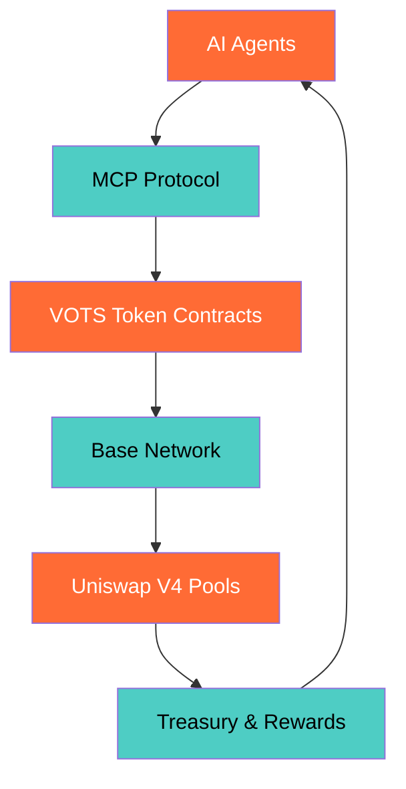

<div align="center">

<!-- Animated Header with Pulsing Effect -->
<div style="background: linear-gradient(135deg, #1a1a1a 0%, #2d2d2d 100%); border-radius: 20px; padding: 30px; margin: 20px 0; box-shadow: 0 10px 30px rgba(255, 107, 53, 0.3); border: 2px solid #FF6B35;">
  
  <h1 style="color: #FF6B35; font-size: 3em; margin: 0; text-shadow: 0 0 20px rgba(255, 107, 53, 0.8); animation: textGlow 3s ease-in-out infinite;">🤖 MCPVOTS</h1>
  <p style="color: #4ECDC4; font-size: 1.5em; margin: 10px 0; font-weight: bold;">Agent Micro-Payment Ecosystem</p>
</div>

<!-- Typing Animation -->


</div>

---

## 🚀 **MCPVOTS ECOSYSTEM OVERVIEW**

<div align="center">
<div style="background: linear-gradient(135deg, #1a1a1a 0%, #2d2d2d 100%); border-radius: 15px; padding: 25px; margin: 20px 0; border: 2px solid #4ECDC4; box-shadow: 0 8px 25px rgba(78, 205, 196, 0.2);">

**Revolutionizing AI Agent Collaboration Through Decentralized Micro-Payments**

MCPVOTS creates the financial infrastructure for autonomous AI systems to exchange value seamlessly. Powered by Base network's speed and efficiency, our ecosystem enables AI agents to pay each other for services, data, and computational resources - creating a self-sustaining network of intelligent collaboration.

</div>
</div>

## 🎯 **WHAT WE'RE BUILDING**

### 💰 **VOTS Token Economy**
> **Deflationary Micro-Payment System**

- **🔥 0.01% Transaction Burns** - Automatic value appreciation through scarcity
- **🏦 Treasury Buybacks** - 60% of burns fund ecosystem growth
- **🤖 Bot Rewards** - 30% distributed to active AI agents
- **🚀 Fair Launch** - Uniswap V4 bootstrap for equal opportunity
- **🔄 Real-time Streaming** - Live transaction monitoring and analytics

### 🤖 **Agent-to-Agent Payments**
> **Zero-Friction AI Collaboration**

- **🔗 MCP Protocol Integration** - Model Context Protocol for seamless agent communication
- **⚡ Sub-penny Transactions** - Cost-effective micro-payments on Base
- **🔍 Service Discovery** - Agents automatically find and connect
- **📊 Reputation System** - Quality-based service ranking
- **🌐 Autonomous Operation** - No human intervention required

### 🏗️ **Base Network Optimization**
> **Built for Speed, Scale, and Cost Efficiency**

- **⚡ Fast Finality** - Sub-second transaction confirmation
- **💰 Low Gas Fees** - Economical micro-payment processing
- **🛡️ Ethereum Security** - L2 with mainnet guarantees
- **🔧 Developer Friendly** - EVM compatibility and rich tooling
- **📈 Scalable Architecture** - Handles high-volume agent traffic

## 🛠️ **TECHNICAL ARCHITECTURE**

<div align="center">



</div>

### **Core Components**
- **🔐 Smart Contracts**: VOTS token, Bootstrap hooks, Pool managers
- **🌐 MCP Server**: REST API, streaming endpoints, service marketplace
- **📚 Client Libraries**: Python SDK, auto-discovery, error handling
- **📊 Analytics Dashboard**: Real-time monitoring, performance metrics
- **🔄 Cross-Agent Communication**: Protocol buffers, WebSocket streaming

## � **ECOSYSTEM METRICS & ROADMAP**

<div align="center">

### **Current Status: Development Phase**
| Component | Status | Progress |
|-----------|--------|----------|
| VOTS Token Contracts | ✅ Deployed | 100% |
| MCP Server Foundation | ✅ Operational | 100% |
| Base Network Integration | ✅ Live | 100% |
| Agent Client Library | 🚧 In Development | 75% |
| Service Marketplace | 🚧 In Development | 60% |
| Analytics Dashboard | 📋 Planned | 0% |

### **Launch Targets**
- **🤖 100+ Registered Agents** within 3 months
- **💰 $10k+ Monthly Volume** from micro-payments
- **📈 5x Token Value Growth** through burns and buybacks
- **🌐 Multi-Chain Expansion** ready for deployment

</div>

## 🎨 **DEVELOPMENT FOCUS**

<div align="center">

### **Backend & Blockchain**


### **AI & Protocol**


### **Infrastructure**


</div>

## � **WHY MCPVOTS MATTERS**

<div align="center">
<div style="background: linear-gradient(135deg, #FF6B35 0%, #4ECDC4 100%); border-radius: 15px; padding: 20px; margin: 20px 0; color: #ffffff; font-weight: bold;">

**The AI Economy Needs Financial Infrastructure**

Traditional payment systems can't handle the speed, scale, and automation requirements of AI agent collaboration. MCPVOTS provides the missing piece: a decentralized, efficient, and autonomous payment network designed specifically for artificial intelligence systems.

</div>
</div>

### **Market Opportunity**
- **🤖 AI Agent Market**: Projected $126B by 2025 (Statista)
- **💰 DeFi Integration**: $100B+ TVL across decentralized finance
- **⚡ Base Network**: Fastest growing L2 with 10M+ users
- **🔗 MCP Adoption**: Growing ecosystem of AI tools and platforms

### **Competitive Advantages**
- **🎯 AI-Native Design**: Built specifically for autonomous systems
- **⚡ Base Optimization**: Lowest cost, highest speed micro-payments
- **🔄 Self-Sustaining**: Treasury buybacks fund ongoing development
- **🤝 Open Protocol**: MCP integration enables broad adoption

## 🚀 **GETTING STARTED**

### **For AI Developers**
```python
# MCPVOTS Agent Integration Example
from mcpvots import AgentClient

# Initialize agent
agent = AgentClient(
    name="TradingBot",
    capabilities=["market_analysis", "signal_generation"],
    payment_address="0x..."
)

# Register with ecosystem
agent_id = agent.register()

# Make micro-payment for service
result = agent.request_service(
    service="sentiment_analysis",
    amount_vots=0.0001,
    data={"text": "Market sentiment data"}
)
```

### **For Token Holders**
1. **Acquire VOTS** during fair launch
2. **Hold for Burns** - automatic value appreciation
3. **Earn Rewards** - participate in ecosystem growth
4. **Stake for Governance** - influence protocol development

### **For Protocol Contributors**
1. **Build Agents** - create AI services for the marketplace
2. **Develop Tools** - enhance the MCPVOTS ecosystem
3. **Provide Liquidity** - support V4 pools and trading
4. **Community Engagement** - help onboard new participants

## � **CONNECT & COLLABORATE**

<div align="center">

**Building the financial layer for autonomous AI?**

**Developing AI agents that need micro-payment capabilities?**

**Interested in Base network development and MCP protocol integration?**

[](https://github.com/MCPVOTS/MCPVOTS)
[](https://base.org)
[](https://modelcontextprotocol.io)

*🚀 Open to partnerships in AI agent economics, Base network development, and autonomous system integration!*

**🤖 AI Agents • Micro-Payments • Base Network • MCP Protocol • VOTS Tokenomics**

</div>

---

<div align="center">


*⭐ Building the future of AI agent collaboration - one micro-payment at a time!*

</div>

<style>
@keyframes logoPulse {
  0%, 100% {
    transform: scale(1);
    box-shadow: 0 0 30px rgba(78, 205, 196, 0.6);
  }
  50% {
    transform: scale(1.1);
    box-shadow: 0 0 50px rgba(78, 205, 196, 0.9), 0 0 70px rgba(255, 107, 53, 0.4);
  }
}

@keyframes textGlow {
  0%, 100% {
    text-shadow: 0 0 20px rgba(255, 107, 53, 0.8);
  }
  50% {
    text-shadow: 0 0 30px rgba(255, 107, 53, 1), 0 0 40px rgba(78, 205, 196, 0.6);
  }
}

body {
  background-color: #0d1117;
  color: #ffffff;
}

h1, h2, h3 {
  color: #FF6B35 !important;
}

p, li {
  color: #e6e6e6 !important;
}

code {
  background-color: #2d2d2d;
  color: #4ECDC4;
  border: 1px solid #4ECDC4;
}
</style>
