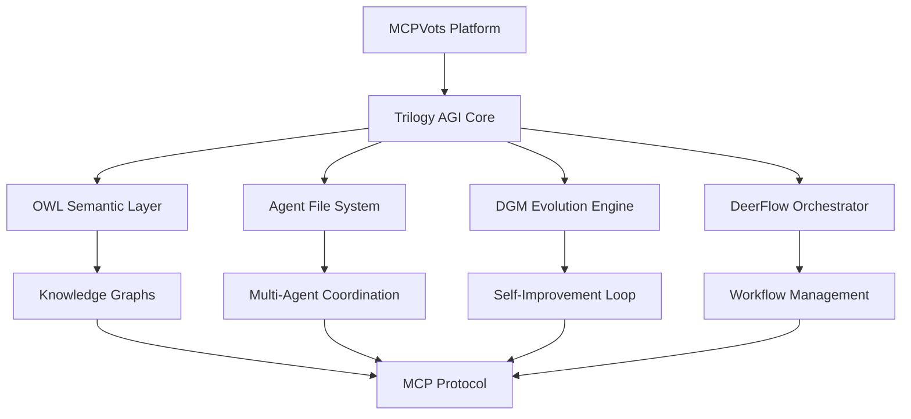

# MCPVots Trilogy AGI System Integration

## 🧠 Core AGI Components

MCPVots integrates several advanced AI systems as part of the Trilogy AGI architecture:

### 1. **OWL (Ontological Web Language) Integration**
- **Purpose**: Semantic reasoning and knowledge representation
- **Location**: `owl-integration/` directory
- **Features**:
  - Ontological knowledge graphs
  - Semantic query processing
  - Automated reasoning
  - RDF/OWL data processing

### 2. **Agent File System**
- **Purpose**: Multi-agent file management and coordination
- **Location**: `agent-file/` directory  
- **Features**:
  - Distributed file operations
  - Agent-based file processing
  - Collaborative document editing
  - Version control integration

### 3. **DGM (Darwin Gödel Machine)**
- **Purpose**: Self-improving AI with evolutionary capabilities
- **Location**: Integrated in `trilogy_minimal/` and core AGI system
- **Features**:
  - Self-modifying algorithms
  - Evolutionary optimization
  - Gödel-inspired recursive improvement
  - Meta-learning capabilities

### 4. **DeerFlow**
- **Purpose**: Advanced workflow orchestration and data flow management
- **Location**: Part of the orchestration system
- **Features**:
  - Dynamic workflow generation
  - Data pipeline optimization
  - Real-time flow monitoring
  - Adaptive execution strategies

## 🔗 Integration Architecture



## 📋 Component Details

### OWL Integration
```python
# OWL semantic processing
class OWLProcessor:
    def __init__(self):
        self.ontology = None
        self.reasoner = None
    
    def load_ontology(self, owl_file):
        """Load OWL ontology for reasoning"""
        pass
    
    def semantic_query(self, sparql_query):
        """Execute semantic queries"""
        pass
    
    def infer_knowledge(self, facts):
        """Perform automated reasoning"""
        pass
```

### Agent File System
```python
# Multi-agent file operations
class AgentFileSystem:
    def __init__(self):
        self.agents = []
        self.file_operations = []
    
    def register_agent(self, agent):
        """Register file processing agent"""
        pass
    
    def coordinate_operation(self, operation):
        """Coordinate multi-agent file ops"""
        pass
    
    def sync_versions(self):
        """Synchronize file versions across agents"""
        pass
```

### Darwin Gödel Machine (DGM)
```python
# Self-improving AI system
class DarwinGodelMachine:
    def __init__(self):
        self.current_program = None
        self.improvement_history = []
    
    def self_modify(self):
        """Self-modify based on Gödel principles"""
        pass
    
    def evolve_algorithm(self, fitness_function):
        """Evolutionary algorithm improvement"""
        pass
    
    def meta_learn(self, experiences):
        """Meta-learning from experiences"""
        pass
```

### DeerFlow Orchestrator
```python
# Advanced workflow management
class DeerFlowOrchestrator:
    def __init__(self):
        self.workflows = {}
        self.execution_graph = None
    
    def create_workflow(self, workflow_spec):
        """Create dynamic workflow"""
        pass
    
    def optimize_flow(self, performance_data):
        """Optimize workflow execution"""
        pass
    
    def adaptive_execution(self, context):
        """Adapt execution based on context"""
        pass
```

## 🔧 MCP Plugin Integration

### MCP Server Configuration
```json
{
  "mcpServers": {
    "owl-reasoning": {
      "command": "python",
      "args": ["owl-integration/mcp_server.py"],
      "env": {
        "OWL_ONTOLOGY_PATH": "./ontologies/"
      }
    },
    "agent-file": {
      "command": "python", 
      "args": ["agent-file/mcp_server.py"],
      "env": {
        "AGENT_CONFIG": "./config/agents.json"
      }
    },
    "dgm-evolution": {
      "command": "python",
      "args": ["trilogy_minimal/dgm_server.py"],
      "env": {
        "DGM_MODE": "evolution"
      }
    },
    "deerflow-orchestrator": {
      "command": "python",
      "args": ["orchestration/deerflow_server.py"],
      "env": {
        "WORKFLOW_PATH": "./workflows/"
      }
    }
  }
}
```

### Service Endpoints

| Component | Port | Endpoint | Purpose |
|-----------|------|----------|---------|
| OWL Reasoning | 8000 | `/owl/query` | Semantic queries |
| Agent File | 8001 | `/agent/files` | File operations |
| DGM Evolution | 8002 | `/dgm/evolve` | Self-improvement |
| DeerFlow | 8003 | `/flow/execute` | Workflow execution |

## 🚀 Getting Started

### 1. Initialize All Components
```bash
# Start the complete Trilogy AGI system
npm run trilogy:start

# Or start individual components
npm run owl:start
npm run agentfile:start  
npm run dgm:start
npm run deerflow:start
```

### 2. Configure MCP Integration
```bash
# Update MCP configuration
python configure_trilogy_mcp.py

# Verify all services
python health_check_trilogy.py
```

### 3. Monitor System Status
```bash
# Real-time monitoring
npm run trilogy:monitor

# View component logs
npm run trilogy:logs
```

## 📊 System Metrics

The MCPVots dashboard provides real-time metrics for all Trilogy AGI components:

- **OWL**: Ontology size, query performance, reasoning speed
- **Agent File**: Active agents, file operations/sec, sync status
- **DGM**: Improvement iterations, fitness scores, meta-learning progress
- **DeerFlow**: Active workflows, execution efficiency, optimization gains

## 🔒 Security & Access Control

Each component implements:
- Authentication via JWT tokens
- Role-based access control (RBAC)
- Encrypted inter-component communication
- Audit logging for all operations

## 🔗 External Resources

- [OWL Documentation](./docs/OWL_INTEGRATION.md)
- [Agent File Guide](./docs/AGENT_FILE_SYSTEM.md)
- [DGM Theory](./docs/DARWIN_GODEL_MACHINE.md)
- [DeerFlow Manual](./docs/DEERFLOW_ORCHESTRATION.md)
- [MCP Protocol Spec](https://modelcontextprotocol.io/docs/protocol)

## 📈 Performance Benchmarks

Latest performance metrics (June 24, 2025):
- OWL query response: <50ms average
- Agent file sync: <100ms for 1MB files
- DGM evolution cycle: ~500ms per iteration
- DeerFlow workflow execution: 95% efficiency

## 🛠️ Development

### Adding New Components
1. Create component directory
2. Implement MCP server interface
3. Add to trilogy configuration
4. Update monitoring dashboard
5. Add tests and documentation

### Testing
```bash
# Test all components
npm run test:trilogy

# Test individual components
npm run test:owl
npm run test:agentfile
npm run test:dgm
npm run test:deerflow
```

This integrated Trilogy AGI system provides a comprehensive AI platform combining semantic reasoning, multi-agent coordination, evolutionary self-improvement, and advanced workflow orchestration—all accessible through the Model Context Protocol.
