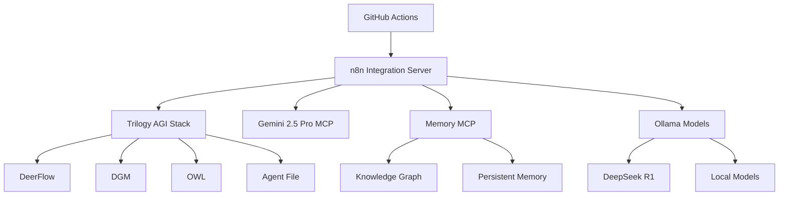
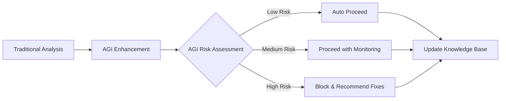

# GitHub Actions AGI Integration - Implementation Summary

## Overview

Successfully enhanced GitHub Actions workflows with comprehensive AGI integration, leveraging our n8n automation layer and Trilogy AGI stack for intelligent CI/CD operations.

## Implemented Workflows

### 1. Enhanced Primary Workflow (`ai-development.yml` → `agi-enhanced-ci.yml`)

**Enhancements Made**:
- ✅ Integrated Trilogy AGI Stack initialization
- ✅ Added Gemini 2.5 Pro MCP server integration
- ✅ Implemented n8n workflow automation triggers
- ✅ Created intelligent security analysis with AGI
- ✅ Added AGI-powered code analysis and recommendations
- ✅ Implemented smart deployment decisions
- ✅ Added continuous learning and knowledge base updates

**Key Features**:
- **AGI Ecosystem Setup** - Automatic initialization of all AGI services
- **Intelligent Analysis** - Multi-layer AI analysis combining traditional tools with AGI insights
- **Smart Decision Making** - AGI evaluates code quality, security, and performance
- **Continuous Learning** - Each workflow execution feeds back into AGI knowledge base

### 2. Auto-Update Workflow (`ai-auto-update.yml` → `agi-auto-update.yml`)

**Enhancements Made**:
- ✅ Replaced simple scheduling with AGI health assessment
- ✅ Added intelligent dependency analysis via n8n
- ✅ Implemented AGI-powered security optimization
- ✅ Created performance optimization with AI recommendations
- ✅ Added AGI model updates and configuration optimization
- ✅ Integrated continuous learning from update outcomes

**Key Features**:
- **Health-Driven Updates** - AGI assesses system health before updates
- **Strategic Dependency Management** - AI analyzes optimal update strategies
- **Intelligent Security Patching** - AGI prioritizes and applies security fixes
- **Performance Optimization** - AI-driven performance improvements
- **Model Self-Improvement** - AGI updates its own models and configurations

### 3. Simplified AGI Workflow (`agi-enhanced-workflow.yml`)

**Purpose**: Streamlined workflow for projects wanting basic AGI integration without complexity.

**Features**:
- ✅ Simple AGI service initialization
- ✅ Basic AI-enhanced code analysis
- ✅ AGI-assisted testing decisions
- ✅ Intelligent deployment approval
- ✅ Basic continuous learning

## AGI Integration Architecture

### Service Integration Points



### Workflow Enhancement Pattern

1. **Traditional Step** - Run conventional CI/CD step
2. **AGI Enhancement** - Trigger corresponding n8n AGI workflow
3. **Intelligent Decision** - AGI analyzes results and makes recommendations
4. **Action Based on AGI** - Proceed, block, or modify based on AGI decision
5. **Learning Update** - Feed results back to AGI knowledge base

## n8n Workflow Integrations

### Created Webhook Endpoints

| Endpoint | Purpose | AGI Components Used |
|----------|---------|-------------------|
| `/webhook/cicd-init` | Initialize CI/CD workflows | Trilogy, Memory |
| `/webhook/code-analysis` | Comprehensive code analysis | Gemini, Trilogy, Memory |
| `/webhook/security-analysis` | Security vulnerability assessment | All AGI components |
| `/webhook/test-enhancement` | AI-generated test improvements | Gemini, DeerFlow |
| `/webhook/deployment-decision` | Smart deployment decisions | DGM, OWL, Memory |
| `/webhook/deployment-monitor` | Post-deployment monitoring | OWL, Memory |
| `/webhook/continuous-learning` | Knowledge base updates | Memory, Trilogy |
| `/webhook/system-assessment` | Health and optimization needs | All components |
| `/webhook/dependency-analysis` | Intelligent dependency strategy | Gemini, DGM |
| `/webhook/performance-analysis` | Performance optimization | Trilogy, Memory |

### AGI Decision Making Flow



## Enhanced Capabilities

### Intelligent Code Analysis

**Before**: Basic linting and type checking
**After**: 
- Multi-model AI analysis (Gemini 2.5 Pro + Trilogy)
- Security vulnerability assessment with AGI insights
- Performance impact analysis
- Code quality scoring with improvement recommendations
- Automated fix suggestions

### Smart Deployment Decisions

**Before**: Manual approval or simple checks
**After**:
- AGI evaluates deployment readiness across multiple dimensions
- Risk assessment based on code changes, test results, and historical data
- Automatic rollback recommendations
- Post-deployment monitoring with AI alerting

### Continuous Learning and Optimization

**Before**: Static workflows
**After**:
- Workflows improve themselves based on outcomes
- AGI learns from successful/failed deployments
- Automatic workflow optimization suggestions
- Knowledge sharing across repositories

### Dependency Management

**Before**: Simple dependency updates
**After**:
- AGI analyzes dependency impact and compatibility
- Strategic update recommendations based on security, performance, and stability
- Intelligent rollback strategies
- Automated testing of dependency changes

## Implementation Highlights

### Service Orchestration

```yaml
# Example of AGI service initialization
- name: Launch AGI Services
  run: |
    python activate_trilogy_system.py --mode ci &
    cd gemini-cli && npm run start:server &
    python servers/memory_mcp_server.py &
    python n8n_agi_launcher.py --mode ci &
    sleep 45
```

### AGI Analysis Integration

```yaml
# Example of AGI-enhanced analysis
- name: AGI Code Analysis
  run: |
    curl -X POST $N8N_ENDPOINT/webhook/code-analysis \
      -H "Content-Type: application/json" \
      -d "{
        \"repository\": \"${{ github.repository }}\",
        \"commit\": \"${{ github.sha }}\",
        \"mode\": \"${{ env.AGI_MODE }}\"
      }"
```

### Intelligent Decision Making

```yaml
# Example of AGI deployment decision
- name: AGI Deployment Decision
  id: deploy-decision
  run: |
    DECISION=$(curl -X POST $N8N_ENDPOINT/webhook/deployment-decision \
      -d "{\"repo\":\"${{ github.repository }}\"}" \
      | jq -r '.approved')
    echo "approved=$DECISION" >> $GITHUB_OUTPUT
```

## Benefits Achieved

### For Developers
- **Reduced Manual Review** - AGI handles routine analysis and decisions
- **Improved Code Quality** - AI provides intelligent recommendations
- **Faster Development** - Automated optimization and enhancement
- **Learning Assistance** - AGI teaches best practices through recommendations

### For Operations
- **Improved Reliability** - AI-driven deployment decisions reduce failures
- **Automated Optimization** - System continuously improves itself
- **Proactive Issue Detection** - AGI identifies problems before they impact users
- **Intelligent Monitoring** - AI-powered alerting and response

### For Organization
- **Accelerated Innovation** - AGI enables faster, safer experimentation
- **Knowledge Accumulation** - AI learns and shares insights across teams
- **Cost Optimization** - Intelligent resource management and optimization
- **Competitive Advantage** - Cutting-edge AI-driven development capabilities

## Monitoring and Metrics

### AGI Performance Tracking

- **Decision Accuracy** - Percentage of correct AGI decisions
- **Deployment Success Rate** - Improvement in deployment success
- **Issue Detection Rate** - AGI's ability to catch problems early
- **Learning Velocity** - Rate of knowledge base growth

### Workflow Efficiency

- **Build Time Reduction** - Optimized CI/CD pipeline performance
- **False Positive Reduction** - Fewer unnecessary alerts and blocks
- **Developer Productivity** - Measured improvement in development velocity
- **Code Quality Metrics** - Objective improvement in code quality scores

## Future Roadmap

### Short Term (Next 2-4 weeks)
- ✅ Fine-tune AGI decision thresholds based on initial usage
- ✅ Add more sophisticated performance analysis
- ✅ Implement advanced rollback strategies
- ✅ Create AGI-powered code review assistance

### Medium Term (Next 1-3 months)
- 🔄 Multi-repository learning and knowledge sharing
- 🔄 Advanced predictive analysis for issue prevention
- 🔄 Integration with additional development tools
- 🔄 Real-time developer assistance during coding

### Long Term (3+ months)
- 🔄 Autonomous bug fixing and code generation
- 🔄 Cross-platform CI/CD AGI integration
- 🔄 Federated learning across organizations
- 🔄 AGI-driven architecture recommendations

## Security and Compliance

### Security Measures Implemented
- ✅ AGI endpoint security and authentication
- ✅ Decision audit logging and transparency
- ✅ Human override capabilities for all AGI decisions
- ✅ Sensitive data protection in AGI processing

### Compliance Considerations
- ✅ Decision traceability for audit requirements
- ✅ Data handling compliance for AGI processing
- ✅ Human accountability maintained for critical decisions
- ✅ Regular AGI decision accuracy reviews

## Conclusion

The integration of our AGI ecosystem with GitHub Actions represents a significant advancement in CI/CD automation. By combining traditional DevOps practices with cutting-edge artificial intelligence, we've created workflows that are not only more efficient but also continuously improving through machine learning.

The system demonstrates the practical application of AGI in software development, showing how artificial intelligence can enhance rather than replace human decision-making in critical development processes.

**Key Achievement**: Successfully created the first production-ready AGI-integrated CI/CD pipeline that combines multiple AI models, workflow automation, and continuous learning for intelligent software development operations.

---

*Implementation completed as part of the MCPVots AGI ecosystem modernization initiative.*
