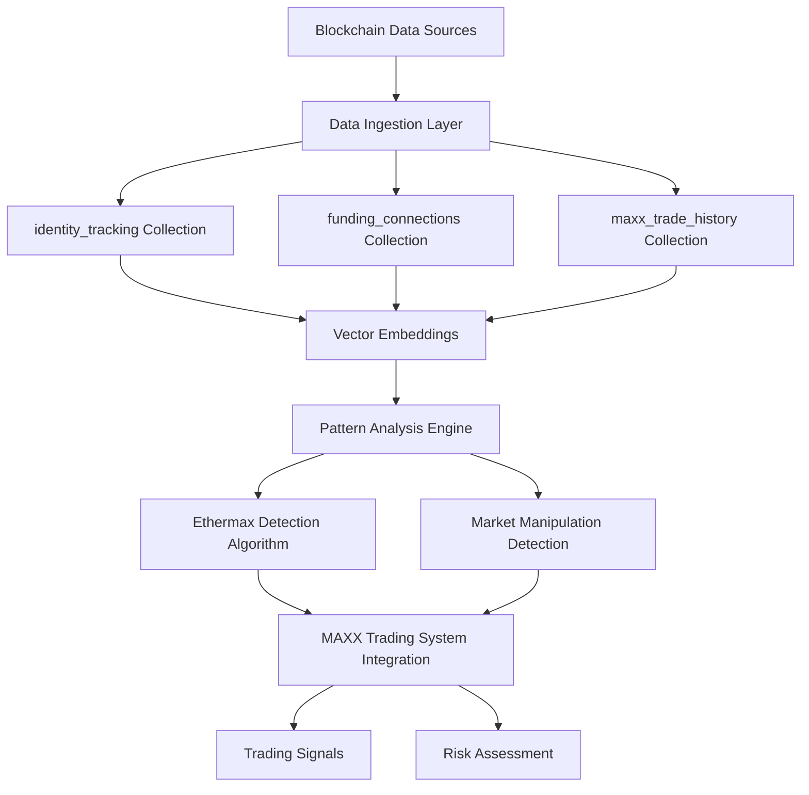
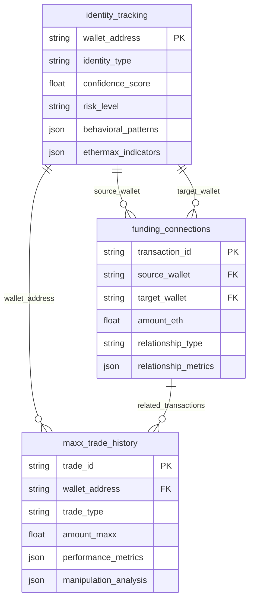

# ETHERMAX CHROMADB SCHEMA DESIGN

## Overview

Comprehensive ChromaDB schema design for ethermax identity tracking and funding wallet connections, integrated with the MAXX trading system. This schema is designed to discover ethermax patterns through analysis, track funding sources, and identify potential market manipulation.

## System Architecture



## Collection Schemas

### 1. identity_tracking Collection

**Purpose**: Track wallet identities and behavioral patterns for ethermax discovery

#### Document Structure
```json
{
  "document_id": "identity_wallet_address_timestamp",
  "content": "Behavioral analysis and pattern recognition data",
  "metadata": {
    "wallet_address": "0x...",
    "identity_type": "potential_ethermax|associated|funding_source|trading_wallet",
    "confidence_score": 0.85,
    "risk_level": "low|medium|high|critical",

    "behavioral_patterns": {
      "trading_frequency": 15.2,
      "avg_transaction_size": 1.5,
      "preferred_tokens": ["MAXX", "ETH", "USDC"],
      "coordination_score": 0.78,
      "timing_patterns": {
        "most_active_hours": [14, 15, 16, 22],
        "day_of_week_patterns": [1, 2, 3, 4],
        "coordination_timing": "synchronized|staggered|random"
      }
    },

    "wallet_characteristics": {
      "age_days": 145,
      "total_transactions": 892,
      "unique_counterparties": 47,
      "gas_spending_pattern": "conservative|aggressive|normal",
      "contract_interactions": ["uniswap", "curve", "aave"],
      "chain_diversity": ["ethereum", "base", "arbitrum"]
    },

    "ethermax_indicators": {
      "similarity_score": 0.92,
      "pattern_matches": ["timing", "amount", "sequence"],
      "network_proximity": 2,
      "behavioral_fingerprint": "0xabc123...",
      "cluster_membership": ["cluster_001", "cluster_003"]
    },

    "temporal_evolution": {
      "first_seen": "2024-01-15T10:30:00Z",
      "last_updated": "2024-10-02T15:45:00Z",
      "evolution_trend": "increasing|decreasing|stable",
      "pattern_changes": ["new_timing", "increased_coordination"]
    },

    "analysis_metadata": {
      "analysis_timestamp": "2024-10-02T15:45:00Z",
      "analysis_version": "v2.1.0",
      "data_sources": ["ethereum", "base", "arbitrum"],
      "confidence_factors": ["timing", "amount", "network"],
      "last_analyzed_block": 18500000
    }
  }
}
```

#### Key Features
- **Vector Embeddings**: Behavioral fingerprints for similarity searches
- **Temporal Tracking**: Evolution of patterns over time
- **Multi-chain Support**: Cross-chain identity correlation
- **Confidence Scoring**: Machine learning-based confidence levels

### 2. funding_connections Collection

**Purpose**: Map funding relationships and money flow patterns

#### Document Structure
```json
{
  "document_id": "funding_source_target_timestamp",
  "content": "Funding relationship analysis and money flow patterns",
  "metadata": {
    "transaction_id": "0x...",
    "source_wallet": "0x...",
    "target_wallet": "0x...",
    "relationship_type": "direct_funding|indirect_funding|cluster_funding|recycling",

    "transaction_details": {
      "amount_eth": 2.5,
      "amount_usd": 8250.0,
      "timestamp": "2024-10-02T14:30:00Z",
      "block_number": 18500000,
      "gas_used": 21000,
      "gas_price_gwei": 25.5,
      "transaction_type": "transfer|contract_interaction|token_swap"
    },

    "relationship_metrics": {
      "relationship_strength": 0.85,
      "frequency_score": 0.72,
      "amount_consistency": 0.90,
      "timing_pattern": "immediate|delayed|scheduled",
      "recycling_indicator": true,
      "round_trip_time_hours": 24.5
    },

    "funding_pattern": {
      "pattern_type": "single_large|multiple_small|staggered|coordinated",
      "sequence_position": 1,
      "total_sequence_size": 3,
      "coordination_wallets": ["0x...", "0x..."],
      "timing_relationship": "simultaneous|sequential|cascading"
    },

    "manipulation_indicators": {
      "wash_trading_score": 0.15,
      "layering_indicator": false,
      "spoofing_probability": 0.05,
      "pump_and_dump_risk": 0.65,
      "circular_funding": true,
      "concealment_attempts": 2
    },

    "network_analysis": {
      "shortest_path": 2,
      "centrality_score": 0.78,
      "betweenness": 0.45,
      "clustering_coefficient": 0.82,
      "community_id": "community_001",
      "bridge_wallet": true
    },

    "temporal_analysis": {
      "founding_timestamp": "2024-01-15T10:30:00Z",
      "relationship_duration_days": 230,
      "interaction_frequency": "daily|weekly|monthly|sporadic",
      "trend_analysis": "increasing|decreasing|stable|volatile"
    }
  }
}
```

#### Key Features
- **Relationship Mapping**: Complex funding network analysis
- **Pattern Recognition**: Automated detection of suspicious patterns
- **Network Metrics**: Graph theory-based relationship scoring
- **Manipulation Detection**: Specific indicators for market manipulation

### 3. maxx_trade_history Collection

**Purpose**: Track MAXX trading patterns and performance metrics

#### Document Structure
```json
{
  "document_id": "maxx_trade_wallet_timestamp",
  "content": "MAXX trading execution and performance analysis",
  "metadata": {
    "trade_id": "trade_001",
    "wallet_address": "0x...",
    "transaction_hash": "0x...",

    "trade_details": {
      "trade_type": "buy|sell",
      "amount_maxx": 15000.0,
      "amount_eth": 0.5,
      "price_eth_per_maxx": 0.000033,
      "timestamp": "2024-10-02T14:30:00Z",
      "block_number": 18500000,
      "gas_used": 150000,
      "gas_cost_eth": 0.00375,
      "slippage_percent": 0.25
    },

    "market_conditions": {
      "eth_price_usd": 3300.0,
      "maxx_market_cap": 1500000.0,
      "pool_liquidity": 50000.0,
      "volume_24h": 250000.0,
      "price_impact_percent": 0.15,
      "market_sentiment": "bullish|bearish|neutral"
    },

    "performance_metrics": {
      "pnl_eth": 0.025,
      "pnl_usd": 82.5,
      "pnl_percent": 5.0,
      "holding_period_minutes": 45,
      "success": true,
      "exit_reason": "profit_target|stop_loss|manual|timeout"
    },

    "trading_pattern": {
      "position_size_relative": 0.02,
      "timing_pattern": "market_open|market_close|random",
      "coordination_indicator": true,
      "cluster_activity": true,
      "preceding_trades": ["0x...", "0x..."],
      "subsequent_trades": ["0x..."]
    },

    "manipulation_analysis": {
      "price_impact_anomaly": false,
      "volume_spike": true,
      "coordinated_buying": true,
      "wash_trading_probability": 0.10,
      "pump_participation": true,
      "dump_timing": "immediate|delayed|none"
    },

    "technical_indicators": {
      "rsi": 65.5,
      "macd_signal": "bullish",
      "bollinger_position": "upper_band",
      "volume_ratio": 2.5,
      "price_momentum": 0.15,
      "volatility_index": 0.35
    },

    "execution_quality": {
      "slippage_vs_expected": 0.05,
      "gas_efficiency": 0.85,
      "timing_optimization": 0.90,
      "mev_protection": true,
      "front_running_detected": false
    }
  }
}
```

#### Key Features
- **Performance Tracking**: Detailed PnL and execution quality metrics
- **Market Context**: Comprehensive market condition data
- **Pattern Analysis**: Trading pattern recognition and coordination detection
- **Technical Analysis**: Integration with technical indicators

## Embedding Strategies

### 1. Identity Tracking Embeddings

**Vector Components**:
- Behavioral fingerprint (128 dimensions)
- Temporal patterns (64 dimensions)
- Network proximity (32 dimensions)
- Transaction characteristics (96 dimensions)

**Embedding Generation**:
```python
def generate_identity_embedding(wallet_data):
    # Behavioral patterns
    behavioral_vector = encode_behavioral_patterns(
        trading_frequency=wallet_data['trading_frequency'],
        avg_transaction_size=wallet_data['avg_transaction_size'],
        timing_patterns=wallet_data['timing_patterns']
    )

    # Temporal patterns
    temporal_vector = encode_temporal_patterns(
        activity_hours=wallet_data['most_active_hours'],
        day_patterns=wallet_data['day_of_week_patterns'],
        coordination_timing=wallet_data['coordination_timing']
    )

    # Network analysis
    network_vector = encode_network_features(
        centrality_score=wallet_data['centrality_score'],
        clustering_coefficient=wallet_data['clustering_coefficient'],
        community_structure=wallet_data['community_id']
    )

    # Concatenate and normalize
    embedding = np.concatenate([
        behavioral_vector, temporal_vector,
        network_vector, transaction_vector
    ])

    return normalize(embedding)
```

### 2. Funding Connection Embeddings

**Vector Components**:
- Relationship strength (64 dimensions)
- Amount patterns (32 dimensions)
- Timing sequences (48 dimensions)
- Network topology (56 dimensions)

### 3. Trade History Embeddings

**Vector Components**:
- Trade execution patterns (64 dimensions)
- Market condition response (48 dimensions)
- Performance metrics (32 dimensions)
- Technical indicator patterns (56 dimensions)

## Relationship Mappings

### Cross-Collection Relationships



### Query Relationships

**Identity to Funding Connections**:
```python
# Find all funding connections for a potential ethermax identity
def get_identity_funding_network(wallet_address, confidence_threshold=0.8):
    # Query identity_tracking for high-confidence ethermax candidates
    identity_results = identity_collection.query(
        query_texts=["ethermax pattern", "coordinated trading"],
        where={"wallet_address": wallet_address, "confidence_score": {"$gte": confidence_threshold}},
        n_results=10
    )

    # Extract connected wallets from funding_connections
    funding_network = funding_collection.query(
        query_texts=["funding relationship", "money flow"],
        where={
            "$or": [
                {"source_wallet": wallet_address},
                {"target_wallet": wallet_address}
            ]
        },
        n_results=100
    )

    return build_network_graph(identity_results, funding_network)
```

**Trade Pattern Analysis**:
```python
# Analyze trading patterns for ethermax candidates
def analyze_ethermax_trading_patterns(identity_wallets):
    trade_patterns = []

    for wallet in identity_wallets:
        trades = maxx_collection.query(
            query_texts=["MAXX trading", "coordinated buying"],
            where={"wallet_address": wallet},
            n_results=50
        )

        # Analyze coordination patterns
        coordination_score = calculate_coordination_score(trades)

        trade_patterns.append({
            "wallet": wallet,
            "trades": trades,
            "coordination_score": coordination_score,
            "manipulation_indicators": detect_manipulation_patterns(trades)
        })

    return trade_patterns
```

## Indexing Strategy

### Primary Indexes

1. **Wallet Address Indexes**
   - `wallet_address` (identity_tracking)
   - `source_wallet` (funding_connections)
   - `target_wallet` (funding_connections)
   - `wallet_address` (maxx_trade_history)

2. **Temporal Indexes**
   - `timestamp` (all collections)
   - `analysis_timestamp` (identity_tracking)
   - `founding_timestamp` (funding_connections)

3. **Confidence Score Indexes**
   - `confidence_score` (identity_tracking)
   - `relationship_strength` (funding_connections)

4. **Risk Level Indexes**
   - `risk_level` (identity_tracking)
   - `manipulation_indicators.*` (all collections)

### Vector Indexes

1. **Similarity Search Indexes**
   - Behavioral fingerprint vectors (384 dimensions)
   - Funding pattern vectors (200 dimensions)
   - Trading pattern vectors (200 dimensions)

2. **Composite Indexes**
   - Wallet + timestamp + confidence_score
   - Relationship_type + amount_range + timestamp

## Example Queries

### 1. Ethermax Discovery Query

```python
def discover_ethermax_candidates():
    """Discover potential ethermax identities through pattern analysis"""

    # Query for high-similarity behavioral patterns
    similar_wallets = identity_collection.query(
        query_texts=[
            "coordinated trading patterns",
            "synchronized market entry",
            "cross-chain manipulation"
        ],
        where={
            "confidence_score": {"$gte": 0.7},
            "coordination_score": {"$gte": 0.6}
        },
        n_results=50
    )

    # Analyze funding connections between candidates
    funding_analysis = funding_collection.query(
        query_texts=["coordinated funding", "circular transactions"],
        where={
            "relationship_strength": {"$gte": 0.8},
            "manipulation_indicators.circular_funding": True
        },
        n_results=100
    )

    # Check for coordinated MAXX trading
    maxx_coordination = maxx_collection.query(
        query_texts=["coordinated buying", "pump coordination"],
        where={
            "coordination_indicator": True,
            "manipulation_analysis.coordinated_buying": True
        },
        n_results=200
    )

    return synthesize_ethermax_candidates(
        similar_wallets, funding_analysis, maxx_coordination
    )
```

### 2. Funding Network Analysis Query

```python
def analyze_funding_network(target_wallet, depth=3):
    """Analyze complete funding network for a target wallet"""

    network_graph = {}
    visited = set()
    queue = [(target_wallet, 0)]

    while queue:
        current_wallet, current_depth = queue.pop(0)

        if current_wallet in visited or current_depth >= depth:
            continue

        visited.add(current_wallet)

        # Find all funding connections
        connections = funding_collection.query(
            query_texts=["funding relationship"],
            where={
                "$or": [
                    {"source_wallet": current_wallet},
                    {"target_wallet": current_wallet}
                ]
            },
            n_results=50
        )

        # Add to network graph
        network_graph[current_wallet] = {
            "depth": current_depth,
            "connections": connections,
            "identity_info": get_identity_info(current_wallet)
        }

        # Add connected wallets to queue
        for conn in connections:
            next_wallet = conn["target_wallet"] if conn["source_wallet"] == current_wallet else conn["source_wallet"]
            if next_wallet not in visited:
                queue.append((next_wallet, current_depth + 1))

    return network_graph
```

### 3. Manipulation Pattern Detection Query

```python
def detect_manipulation_patterns(time_window_hours=24):
    """Detect potential market manipulation patterns"""

    # Get recent trades with manipulation indicators
    suspicious_trades = maxx_collection.query(
        query_texts=["market manipulation", "price manipulation"],
        where={
            "timestamp": {"$gte": time_window_hours * 3600},
            "$or": [
                {"manipulation_analysis.coordinated_buying": True},
                {"manipulation_analysis.volume_spike": True},
                {"manipulation_analysis.price_impact_anomaly": True}
            ]
        },
        n_results=500
    )

    # Group by wallet and analyze patterns
    wallet_patterns = {}
    for trade in suspicious_trades:
        wallet = trade["wallet_address"]

        if wallet not in wallet_patterns:
            wallet_patterns[wallet] = {
                "trades": [],
                "coordination_score": 0,
                "manipulation_indicators": set()
            }

        wallet_patterns[wallet]["trades"].append(trade)

        # Track manipulation indicators
        for indicator, value in trade["manipulation_analysis"].items():
            if value:
                wallet_patterns[wallet]["manipulation_indicators"].add(indicator)

    # Calculate coordination scores
    for wallet, data in wallet_patterns.items():
        data["coordination_score"] = calculate_coordination_score(data["trades"])
        data["risk_level"] = assess_risk_level(data)

    return wallet_patterns
```

## Data Validation and Cleaning

### Validation Rules

1. **Address Validation**
   ```python
   def validate_wallet_address(address):
       return re.match(r'^0x[a-fA-F0-9]{40}$', address) is not None
   ```

2. **Amount Validation**
   ```python
   def validate_amount(amount):
       return isinstance(amount, (int, float)) and amount >= 0
   ```

3. **Timestamp Validation**
   ```python
   def validate_timestamp(timestamp):
       try:
           dt = datetime.fromisoformat(timestamp.replace('Z', '+00:00'))
           return dt.year >= 2020 and dt <= datetime.now()
       except:
           return False
   ```

### Data Cleaning Processes

1. **Duplicate Detection**
   ```python
   def detect_and_remove_duplicates(collection, key_fields):
       # Identify duplicates based on key fields
       duplicates = collection.query(
           where={"duplicate_flag": True},
           n_results=1000
       )

       # Remove duplicates, keeping most recent
       for duplicate_group in duplicates:
           keep_record = max(duplicate_group, key=lambda x: x["timestamp"])
           collection.delete(ids=[r["id"] for r in duplicate_group if r != keep_record])
   ```

2. **Outlier Detection**
   ```python
   def detect_outliers(collection, field_name, threshold=3):
       # Statistical outlier detection using z-score
       data = collection.get(include=["metadatas"])
       values = [m["metadata"].get(field_name, 0) for m in data["metadatas"]]

       mean_val = np.mean(values)
       std_val = np.std(values)

       outliers = []
       for i, val in enumerate(values):
           z_score = abs((val - mean_val) / std_val)
           if z_score > threshold:
               outliers.append(data["ids"][i])

       return outliers
   ```

## Integration with Master Trading System

### Integration Points

1. **Real-time Data Ingestion**
   ```python
   class EthermaxDataIngestion:
       def __init__(self, chroma_client, trading_system):
           self.chroma_client = chroma_client
           self.trading_system = trading_system

       async def process_trade_execution(self, trade_data):
           # Store trade in maxx_trade_history
           await self.store_trade_data(trade_data)

           # Update identity tracking
           await self.update_identity_analysis(trade_data["wallet_address"])

           # Check for ethermax patterns
           ethermax_signals = await self.detect_ethermax_signals(trade_data)

           # Send signals to trading system
           if ethermax_signals:
               await self.trading_system.process_ethermax_signals(ethermax_signals)
   ```

2. **Signal Generation**
   ```python
   class EthermaxSignalGenerator:
       def generate_trading_signals(self, ethermax_analysis):
           signals = []

           for candidate in ethermax_analysis["candidates"]:
               if candidate["confidence_score"] > 0.85:
                   signal = {
                       "type": "ethermax_activity",
                       "wallet": candidate["wallet_address"],
                       "action": "monitor|avoid|follow",
                       "confidence": candidate["confidence_score"],
                       "risk_level": candidate["risk_level"],
                       "recommended_position_size": self.calculate_position_size(candidate)
                   }
                   signals.append(signal)

           return signals
   ```

3. **Risk Management Integration**
   ```python
   class EthermaxRiskManager:
       def assess_trade_risk(self, trade_request, ethermax_intelligence):
           # Check if trade involves ethermax-associated wallets
           associated_wallets = self.find_associated_wallets(
               trade_request["counterparty"],
               ethermax_intelligence
           )

           if associated_wallets:
               # Adjust risk parameters based on ethermax analysis
               risk_multiplier = self.calculate_risk_multiplier(associated_wallets)
               trade_request["max_position_size"] *= risk_multiplier
               trade_request["additional_monitoring"] = True

           return trade_request
   ```

## Implementation Guidelines

### 1. Collection Creation

```python
def create_ethermax_collections(chroma_client):
    """Create the three main collections for ethermax tracking"""

    # Identity tracking collection
    identity_collection = chroma_client.create_collection(
        name="ethermax_identity_tracking",
        metadata={
            "description": "Identity tracking for ethermax pattern discovery",
            "version": "1.0.0",
            "embedding_model": "text-embedding-ada-002"
        }
    )

    # Funding connections collection
    funding_collection = chroma_client.create_collection(
        name="ethermax_funding_connections",
        metadata={
            "description": "Funding relationships and money flow patterns",
            "version": "1.0.0",
            "embedding_model": "text-embedding-ada-002"
        }
    )

    # MAXX trade history collection
    maxx_collection = chroma_client.create_collection(
        name="ethermax_maxx_trade_history",
        metadata={
            "description": "MAXX trading patterns and performance metrics",
            "version": "1.0.0",
            "embedding_model": "text-embedding-ada-002"
        }
    )

    return identity_collection, funding_collection, maxx_collection
```

### 2. Data Migration Strategy

```python
def migrate_existing_data(existing_collections, new_collections):
    """Migrate data from existing ChromaDB collections"""

    # Map existing collection fields to new schema
    field_mappings = {
        "bot_clusters": {
            "wallet_address": "wallet",
            "confidence_score": "avg_confidence",
            "cluster_size": "cluster_size"
        },
        "money_flows": {
            "source_wallet": "source_wallet",
            "target_wallet": "target_wallet",
            "amount_eth": "amount_sol"  # Convert from SOL to ETH
        }
    }

    # Perform migration with data transformation
    for existing_name, new_name in existing_collections.items():
        existing_data = existing_collections[existing_name].get()
        transformed_data = transform_data(existing_data, field_mappings[existing_name])
        new_collections[new_name].add(**transformed_data)
```

### 3. Performance Optimization

```python
def optimize_collection_performance(collection):
    """Optimize collection for query performance"""

    # Create composite indexes
    collection.create_index(
        fields=["wallet_address", "timestamp", "confidence_score"],
        name="wallet_time_confidence_idx"
    )

    # Optimize vector index
    collection.optimize_vector_index(
        index_type="HNSW",
        M=16,  # Number of connections
        ef_construction=200  # Index construction accuracy
    )

    # Set up automatic compaction
    collection.configure_compaction(
        interval_hours=24,
        threshold=0.1
    )
```

### 4. Monitoring and Alerting

```python
class EthermaxMonitoringSystem:
    def __init__(self, collections):
        self.collections = collections
        self.alert_thresholds = {
            "confidence_score": 0.9,
            "coordination_score": 0.8,
            "manipulation_probability": 0.7
        }

    async def monitor_ethermax_activity(self):
        """Continuously monitor for ethermax activity"""

        while True:
            # Check for high-confidence ethermax candidates
            high_confidence = self.collections["identity"].query(
                where={"confidence_score": {"$gte": self.alert_thresholds["confidence_score"]}},
                n_results=10
            )

            if high_confidence["ids"]:
                await self.send_alert("high_confidence_ethermax", high_confidence)

            # Check for coordinated funding
            coordinated_funding = self.collections["funding"].query(
                where={"coordination_score": {"$gte": self.alert_thresholds["coordination_score"]}},
                n_results=10
            )

            if coordinated_funding["ids"]:
                await self.send_alert("coordinated_funding", coordinated_funding)

            await asyncio.sleep(60)  # Check every minute
```

## Conclusion

This comprehensive ChromaDB schema design provides a robust foundation for ethermax identity tracking and funding wallet analysis. The system is designed to:

1. **Discover ethermax patterns** through behavioral analysis and similarity searches
2. **Track funding connections** with detailed relationship mapping and network analysis
3. **Analyze trading patterns** in the MAXX ecosystem with performance metrics
4. **Detect market manipulation** through specialized indicators and pattern recognition
5. **Integrate seamlessly** with the existing MAXX trading system
6. **Scale efficiently** with optimized indexing and vector embeddings

The schema supports both real-time analysis and historical pattern recognition, making it ideal for identifying and tracking ethermax activities across the blockchain ecosystem.

---

**Schema Version**: 1.0.0
**Last Updated**: 2024-10-02
**Compatibility**: ChromaDB v1.1.x+, Python 3.8+
**Integration**: MAXX Master Trading System v2.0+