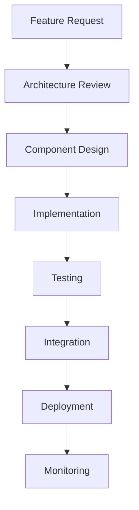

# MAXX ECOSYSTEM ARCHITECTURE GUIDE
## LLM-Friendly Development Documentation

### 🎯 **OVERVIEW**
The MAXX Ecosystem is a comprehensive on-chain trading and intelligence platform built on Base (Ethereum Layer 2). This guide provides detailed technical architecture for developers and AI assistants to understand, maintain, and extend the system.

---

## 🏗️ **SYSTEM ARCHITECTURE**

### **Core Components Hierarchy**
```
MAXX Ecosystem
├── 🎨 Frontend Layer (Next.js + RainbowKit)
│   ├── Real-time Dashboard
│   ├── Wallet Integration
│   └── Trading Controls
├── 🤖 Backend Services (Python)
│   ├── master_trading_system.py
│   ├── maxx_intelligence_analyzer.py
│   └── Kyber Integration
├── 📊 Data Layer
│   ├── SQLite Database
│   ├── JSON Intelligence Reports
│   └── WebSocket Real-time Feed
└── 🔗 Blockchain Layer
    ├── Base Network (Primary)
    ├── Multi-Network Support
    └── DEX Aggregators
```

---

## 🎨 **FRONTEND ARCHITECTURE**

### **Tech Stack**
- **Framework**: Next.js 15.5.6 (App Router, TypeScript)
- **Styling**: Tailwind CSS with custom cyberpunk theme
- **3D Graphics**: Three.js for particle backgrounds
- **Wallet**: RainbowKit v2.2.9 + Wagmi v2.18.1 + Viem v2.38.3
- **State**: React hooks with real-time WebSocket updates

### **Key Files Structure**
```
app/
├── page.tsx              # Main dashboard component
├── providers.tsx         # RainbowKit + Wagmi configuration
├── components/
│   └── DemoComponents.tsx # Reusable UI components
└── globals.css          # Cyberpunk theme variables
```

### **Component Architecture**

#### **Main Dashboard (page.tsx)**
```typescript
// Core State Management
const [tickData, setTickData] = useState<TickData | null>(null);
const [performanceData, setPerformanceData] = useState<PerformanceData>({...});
const [tradingConfig, setTradingConfig] = useState({...});

// Wallet Integration
const { address } = useAccount();
const chainId = useChainId();

// Base Name Resolution
const { data: baseName } = useReadContract({...});

// WebSocket Connection
useEffect(() => { /* Real-time data feed */ }, []);

// Three.js Background
useEffect(() => { /* Cyberpunk particle system */ }, []);
```

#### **RainbowKit Configuration (providers.tsx)**
```typescript
const config = getDefaultConfig({
  appName: 'MAXX Trading Bot',
  chains: [mainnet, base, sepolia, polygon, arbitrum, optimism],
  projectId: process.env.NEXT_PUBLIC_WALLETCONNECT_PROJECT_ID
});

<RainbowKitProvider
  theme={darkTheme({...})}
  modalSize="compact"
  coolMode
  initialChain={base}  // Base prioritized
>
```

### **Responsive Design System**
```css
/* Breakpoint Strategy */
max-w-sm: 384px   /* Mobile */
max-w-md: 448px   /* Small tablets */
max-w-lg: 512px   /* Tablets */
max-w-xl: 576px   /* Small desktops */
max-w-2xl: 672px  /* Large desktops */

/* Component Scaling */
text-xs sm:text-sm  /* Font sizes */
p-3 sm:p-4         /* Padding */
gap-2 sm:gap-3     /* Spacing */
w-12 h-12 sm:w-16 sm:h-16  /* Element sizes */
```

---

## 🤖 **BACKEND ARCHITECTURE**

### **Python Services Stack**
- **Core**: Python 3.8+ with async support
- **Web3**: Web3.py for blockchain interactions
- **DEX**: Kyber Network aggregator integration
- **Data**: SQLite for persistence, JSON for reports
- **APIs**: BaseScan, DexScreener, custom WebSocket

### **Service Architecture**

#### **Master Trading System**
```python
class MasterTradingSystem:
    def __init__(self):
        self.web3 = Web3(Web3.HTTPProvider(BASE_RPC_URL))
        self.account = self.web3.eth.account.from_key(PRIVATE_KEY)

    def execute_trade(self, token_in, token_out, amount):
        # Kyber aggregator integration
        # Gas optimization with EIP-1559
        # Transaction broadcasting

    def reactive_strategy(self):
        # Monitor price movements
        # Execute buy/sell based on thresholds
        # Risk management
```

#### **Intelligence Analyzer**
```python
class MaxxIntelligenceAnalyzer:
    def __init__(self):
        self.db = sqlite3.connect('pumpfun_ecosystem.db')

    def analyze_transfers(self, csv_path=None):
        # BaseScan API integration
        # Transfer pattern analysis
        # Pump detection algorithms
        # Whale tracking

    def generate_signals(self):
        # Correlation analysis
        # Risk assessment
        # Trading recommendations
```

### **Data Flow Architecture**
```
User Request → Frontend → WebSocket → Python Service → Blockchain → Response
                      ↓
              Real-time Updates ← Database ← Intelligence Analysis
```

---

## 🔗 **BLOCKCHAIN INTEGRATION**

### **Network Configuration**
```typescript
// Supported Networks
const networks = {
  mainnet: { id: 1, name: 'Ethereum' },
  base: { id: 8453, name: 'Base', rpc: 'https://mainnet.base.org' },
  polygon: { id: 137, name: 'Polygon' },
  arbitrum: { id: 42161, name: 'Arbitrum' },
  optimism: { id: 10, name: 'Optimism' }
};
```

### **DEX Integration**
```python
# Kyber Network Aggregator
KYBER_CONTRACT = '0x6131B5fae19EA4f9D964eAc0408E4408b66337b5'

def get_quote(token_in, token_out, amount):
    # Query best swap routes
    # Calculate slippage protection
    # Return optimal path

def execute_swap(path, amount, slippage):
    # Build transaction
    # Set gas parameters
    # Broadcast to network
```

### **Base Names Integration**
```typescript
// Contract: 0x4cCb0BB02FCABA27e82a56646E81d8c5bC4119a5
const baseNameAbi = [{
  inputs: [{ name: 'addr', type: 'address' }],
  name: 'getName',
  outputs: [{ name: '', type: 'string' }],
  stateMutability: 'view',
  type: 'function'
}];

// Usage in React
const { data: baseName } = useReadContract({
  address: BASENAMES_CONTRACT,
  abi: baseNameAbi,
  functionName: 'getName',
  args: [userAddress],
  chainId: base.id
});
```

---

## 📊 **DATA ARCHITECTURE**

### **Database Schema**
```sql
-- Trades and Analytics
CREATE TABLE transfers (
    hash TEXT PRIMARY KEY,
    block_number INTEGER,
    timestamp INTEGER,
    from_addr TEXT,
    to_addr TEXT,
    value REAL,
    token_symbol TEXT,
    usd_value REAL
);

-- Intelligence Reports
CREATE TABLE analytics (
    date TEXT,
    pump_events INTEGER,
    whale_addresses TEXT,
    correlation_score REAL,
    risk_level TEXT
);
```

### **JSON Report Structure**
```json
{
  "analysis_period": "2025-01-01 to 2025-01-17",
  "total_transfers": 15420,
  "unique_addresses": 2847,
  "pump_events": [
    {
      "timestamp": 1640995200,
      "magnitude": 3.2,
      "participants": 45,
      "tokens_involved": ["MAXX", "WETH"]
    }
  ],
  "whale_analysis": {
    "top_holders": [...],
    "accumulation_patterns": [...],
    "risk_assessment": "MEDIUM"
  }
}
```

---

## 🚀 **DEPLOYMENT & DEVELOPMENT**

### **Environment Setup**
```bash
# Frontend
cd base-mini-apps/demos/mini-apps/workshops/my-simple-mini-app
npm install
npm run dev

# Backend
cd MAXX_ECOSYSTEM
python -m venv venv
source venv/bin/activate  # Windows: venv\Scripts\activate
pip install -r requirements.txt
python master_trading_system.py --mode status
```

### **Development Workflow**


### **Key Development Patterns**

#### **Error Handling**
```typescript
// Frontend Error Boundaries
try {
  // Risky operations
} catch (error) {
  console.error('Component error:', error);
  // Graceful fallback UI
}
```

```python
# Backend Error Handling
try:
    # Blockchain operations
    tx_hash = execute_trade(params)
except Exception as e:
    logger.error(f"Trade failed: {e}")
    # Retry logic or alert user
```

#### **State Management**
```typescript
// Optimistic Updates
const [pendingTx, setPendingTx] = useState(false);

const executeTrade = async () => {
  setPendingTx(true);
  try {
    // Execute transaction
    await sendTransaction(txData);
    // Update UI optimistically
    updateBalances(newBalances);
  } finally {
    setPendingTx(false);
  }
};
```

---

## 🔧 **EXTENSIBILITY GUIDE**

### **Adding New Networks**
```typescript
// 1. Import new chain
import { newChain } from 'wagmi/chains';

// 2. Add to chains array
const config = getDefaultConfig({
  chains: [mainnet, base, newChain], // Add here
  // ... other config
});

// 3. Update UI components
// Components automatically support new chains
```

### **Adding New DEX Integrations**
```python
class NewDexAdapter:
    def __init__(self):
        self.contract_address = "0x..."
        self.router_abi = [...]

    def get_quote(self, token_in, token_out, amount):
        # Implement DEX-specific logic
        pass

    def build_swap_tx(self, path, amount):
        # Build transaction data
        pass

# Integration in master system
dex_adapters = {
    'kyber': KyberAdapter(),
    'new_dex': NewDexAdapter()
}
```

### **Adding New Analytics**
```python
def analyze_new_pattern(transfers_df):
    """
    Analyze custom patterns in transfer data

    Args:
        transfers_df: Pandas DataFrame with transfer data

    Returns:
        dict: Analysis results
    """
    # Custom analysis logic
    patterns = detect_patterns(transfers_df)
    correlations = calculate_correlations(patterns)

    return {
        'patterns_detected': len(patterns),
        'correlation_score': correlations,
        'recommendations': generate_recommendations(patterns)
    }
```

---

## 📈 **PERFORMANCE OPTIMIZATION**

### **Frontend Optimizations**
- **Three.js**: Limited particle count, pixel ratio capping
- **WebSocket**: Connection pooling, automatic reconnection
- **Images**: Next.js Image optimization, lazy loading
- **Bundle**: Code splitting, tree shaking

### **Backend Optimizations**
- **Database**: Indexed queries, connection pooling
- **API Calls**: Rate limiting, caching, batch requests
- **Memory**: Efficient data structures, garbage collection
- **Concurrency**: Async operations, thread pooling

### **Blockchain Optimizations**
- **Gas**: EIP-1559 dynamic fees, transaction batching
- **RPC**: Multiple providers, failover logic
- **Caching**: Block data caching, price feed optimization

---

## 🔒 **SECURITY CONSIDERATIONS**

### **Frontend Security**
- **Input Validation**: Sanitize all user inputs
- **Wallet Security**: Never store private keys
- **API Security**: Use HTTPS, validate responses
- **State Security**: Secure local storage usage

### **Backend Security**
- **Key Management**: Secure private key storage
- **Transaction Validation**: Verify all blockchain operations
- **Rate Limiting**: Prevent API abuse
- **Logging**: Secure audit trails

### **Smart Contract Security**
- **Input Validation**: Check all contract inputs
- **Access Control**: Proper permission systems
- **Reentrancy Protection**: Guard against reentrancy attacks
- **Oracle Security**: Validate price feed data

---

## 🧪 **TESTING STRATEGY**

### **Unit Testing**
```typescript
// Component Testing
describe('WalletConnection', () => {
  it('should display Base name when available', () => {
    render(<WalletConnection />);
    expect(screen.getByText('user.base.eth')).toBeInTheDocument();
  });
});
```

```python
# Backend Testing
def test_trade_execution():
    system = MasterTradingSystem()
    result = system.execute_trade(TOKEN_IN, TOKEN_OUT, AMOUNT)
    assert result['status'] == 'success'
    assert 'tx_hash' in result
```

### **Integration Testing**
- **End-to-End**: Full trading workflows
- **API Testing**: Blockchain interactions
- **UI Testing**: User interaction flows
- **Performance**: Load and stress testing

---

## 📚 **RESOURCES & REFERENCES**

### **Key Dependencies**
- **RainbowKit**: https://www.rainbowkit.com
- **Wagmi**: https://wagmi.sh
- **Three.js**: https://threejs.org
- **Kyber Network**: https://kyber.network
- **Base Network**: https://base.org

### **Development Tools**
- **VS Code**: Primary IDE
- **Git**: Version control
- **Docker**: Containerization (future)
- **Vercel**: Frontend deployment
- **BaseScan**: Blockchain explorer

### **Community Resources**
- **Base Discord**: https://discord.gg/base
- **RainbowKit Discord**: https://discord.gg/rainbowkit
- **Kyber Documentation**: https://docs.kyber.network

---

## 🎯 **CONTRIBUTION GUIDELINES**

### **Code Standards**
- **TypeScript**: Strict type checking enabled
- **ESLint**: Airbnb config with React rules
- **Prettier**: Consistent code formatting
- **Testing**: 80%+ code coverage target

### **Git Workflow**
```bash
# Feature development
git checkout -b feature/new-component
# Make changes
git commit -m "feat: add new component"
# Create PR
gh pr create --title "Add new component" --body "Description"
```

### **Documentation Updates**
- Update this guide for significant changes
- Add inline code comments for complex logic
- Maintain API documentation
- Update deployment guides

---

*This architecture guide is designed to be LLM-friendly, providing comprehensive context for AI assistants to understand, maintain, and extend the MAXX Ecosystem effectively.*</content>
<parameter name="filePath">c:\PumpFun_Ecosystem\ECOSYSTEM_UNIFIED\MAXX_ARCHITECTURE_GUIDE.md